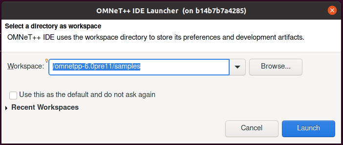

# 5G-experimental-omnetpp

Docker image for network simulator [omnetpp](https://github.com/omnetpp/omnetpp) with [Simu5G](https://github.com/Unipisa/Simu5G) support based on [x11docker](https://github.com/mviereck/x11docker)

## Requirements

1. Install [docker for ubuntu](https://docs.docker.com/engine/install/ubuntu/)
2. [Manage Docker as non-root user](https://docs.docker.com/engine/install/linux-postinstall/)
3. Install x11docker:

    ```sh
    curl -fsSL https://raw.githubusercontent.com/mviereck/x11docker/master/x11docker | sudo bash -s -- --update
    ```

4. Pull the image from dockerhub or clone and built this project locally

    ```sh
    docker pull firejox/omnetpp-dock
    ```

## How to use

1. The following command will start an interactive shell. The omnetpp source code will be located in`/omnetpp-6.0pre11`.

    ```sh
    x11docker -i firejox/omnetpp-dock
    ```

2. When you enter the interactive shell, you should go into the `/omnetpp-6.0pre11`: `cd ../../omnetpp-6.0pre11`

3. Run `setenv` in `/omnetpp-6.0pre11` to setup the `PATH` variable.

    ```sh
    cd /omnetpp-6.0pre11
    source ./setenv
    ```

4. Select the `/omnetpp-6.0pre11/samples` as workspace

    

5. Import projects:

    

6. Open projects into the workspace

    

7. Import two projects:

    

8. Go to simu5g/simulations. E.g.:

    

9. Use the simulation. E.g.:

    